#  House Prices - Advanced Regression Techniques
## Predict sales prices and practice feature engineering, RFs, and gradient boosting
This project is from [Kaggle]("https://www.kaggle.com/competitions/house-prices-advanced-regression-techniques/overview"). You can upload your result in the Kaggle competitions and have fun!


### Practice Skills
- Creative feature engineering
- Advanced regression techniques like random forest and gradient boosting

### Data
- You can download the data from this repo "train.csv"
- "test.csv" is the test from Kaggle that you use the information to predict your sale prices and upload yours in Kaggle. I have mine "test_results.csv" for your reference.

## EDA (main.ipynb)
- use ```pandas``` to convert the dataset to dataframe to have a general idea of the dataset
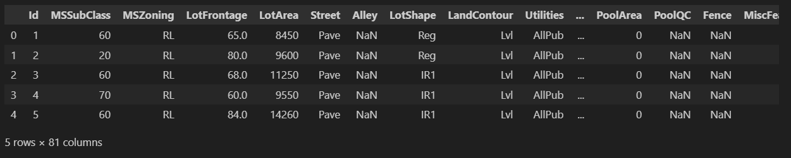
- explore the data types ```dtypes```
- plot a graph to check our target value distribution ```seaborn```, ``` histplot```: it is screwed. It should use `log`
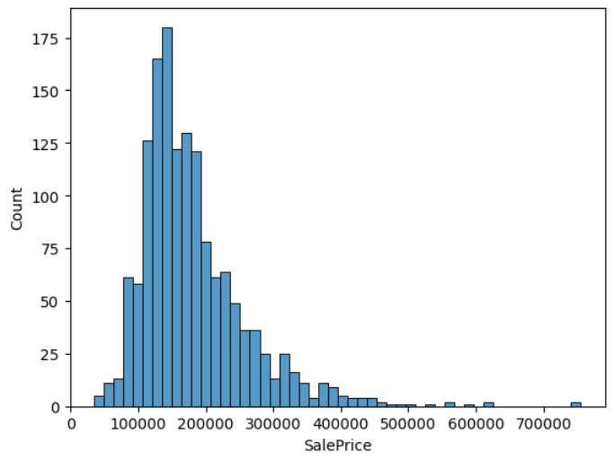
- cleaning data: change to column name and data fields to lower case, replace space with "_"
- translate some column value to their actual names, not just a representive number
- check numerical values, extreme value like 9999999999999 ```describe().round()```. ```T``` make it easier to check all the values without scrolling.
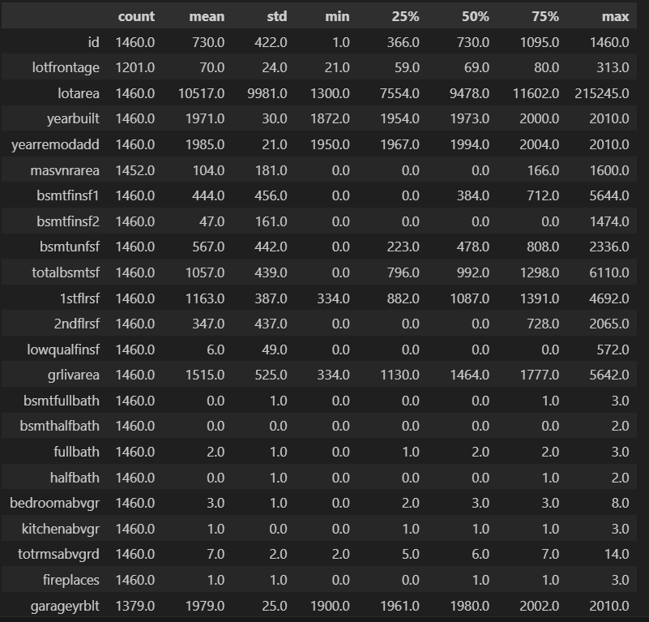
- remove useless columns for the project

## Prepare data for model training
- split the data into train, validation and test (60%, 20%, 20%)
- get final target value and change it to log value
- reset the index
- remove the target value column
- fill NaN with 0
- make the dataframe records to dictionary
- apply one-hot-encoding for categorical values

## Training models
- We don't know what model is the best fit. We will train different models and test the rmse. The model that returns the best rmse wins.

### Decision Tree
- use ```DecisionTreeRegressor()```
- compare ```y_pred```(with `X_train`) and ```y_train```, it shows ```rmse=0```. compare ```y_pred```(with `X_val`) and ```y_train```, it shows ```rmse=0.2256```.The training model is overfitting.
    **tuning**
    - ```max_depth```(how many trees): pick a relative low rmse value; the result can be varied.
        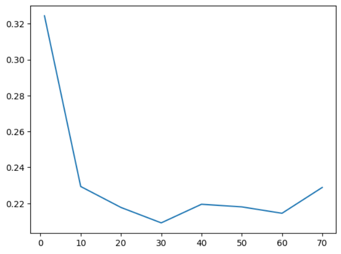

        - pick ```max_depth=10``` -> train rmse gets better already
    - `min_saples_leaf`(how big the tree is): set a range of max_depth from last step, in each depth, loop through a group of `min_saples_leaf`
        - make a dataframe of `"max_depth", "min_samples_leaf", "rmse"` and use seaborn to generate a heatmap; pick the best combination ```max_depth=10, min_samples_leaf=5```
        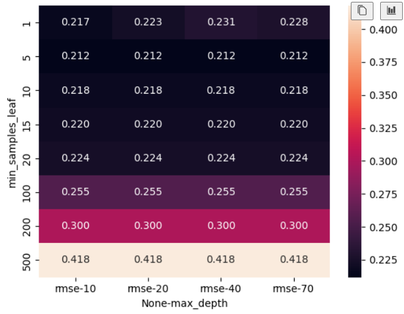
        - calculate the rmse
    - use `feature_importances_` to check top 20 important features
    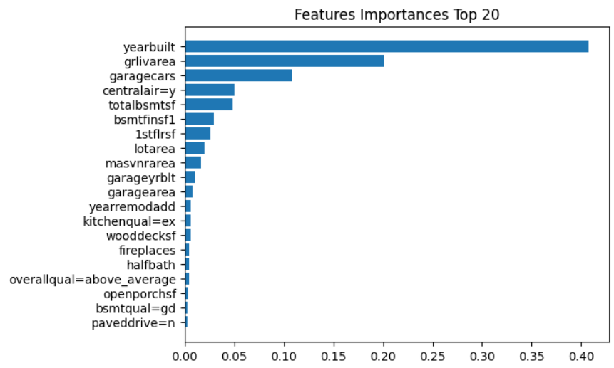

### Random Forest
- `from sklearn.ensemble import RandomForestRegressor`
- pick a range from 10 to 200 to train the model
- turn it to dataframe and plot it (`n_estimators = 160` is the best), but we dont fix it yet
    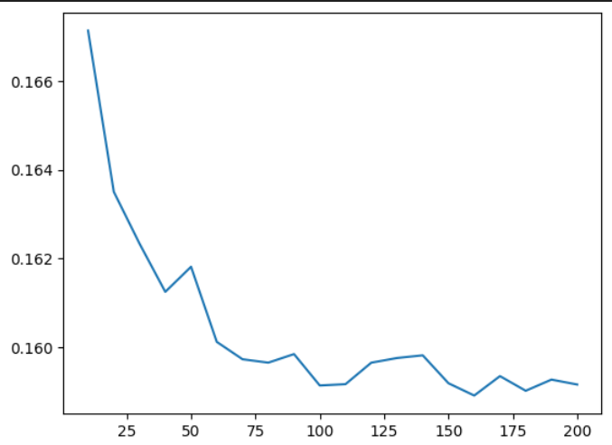
    **tuning**
    - `max_depth`: range [20, 30, 40, 50, 60, 70]
        - each depth, loop all the `n_estimator`
        - set the seed to fix the result `random_state=1`, help the model process faster [optional]`n_jobs=-1`
        - plot the result to find the best `max_depth`: 20 .............................
    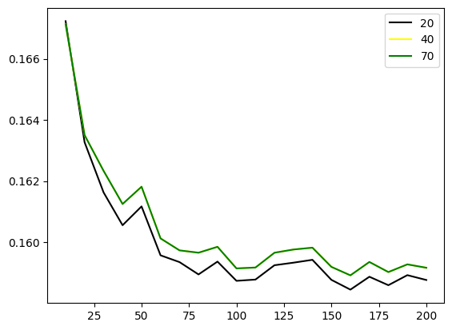
    - `min_samples_leaf`(how big the tree is): range [1, 5, 10, 15, 20]
        - each `min_samples_leaf`, loop all the `n_estimator`
        - `max_depth`: 20, set the seed to fix the result `random_state=1`, help the model process faster [optional]`n_jobs=-1`
        - plot the result to find the best `min_samples_leaf`: 1
    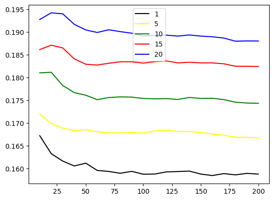
- use `n_estimators=160, max_depth=20, min_samples_leaf=1` to train the model
- rmse result improve comparing to decision tree model

### XGBoost
- `import xgboost as xgb`
- train the model
    ```features = list(dv.get_feature_names_out())
    dtrain = xgb.DMatrix(X_train, label=y_train, feature_names=features)
    dval = xgb.DMatrix(X_val, label=y_val, feature_names=features)```
- xgb_output(output) function to capture the output (number interation, train_rmse, val_rmse)
- plot the graph .........................................................
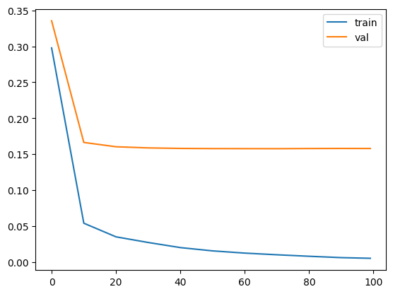
- `from IPython.utils.capture import capture_output`
  `import sys`
   to save the result using loop

    **tuning**
    - `eta`: ETA is the learning rate of the model. XGBoost uses gradient descent to calculate and update the model. In gradient descent, we are looking for the minimum weights that help the model to learn the data very well. This minimum weights for the features is updated each time the model passes through the features and learns the features during training. Tuning the learning rate helps you tell the model what speed it would use in deriving the minimum for the weights.
    `eta=0.3` is the best (faster and more accurate)
    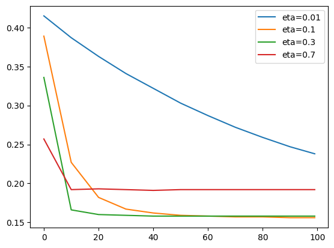
    - `max_depth`: how many trees? `max_depth=6` is the best........................
    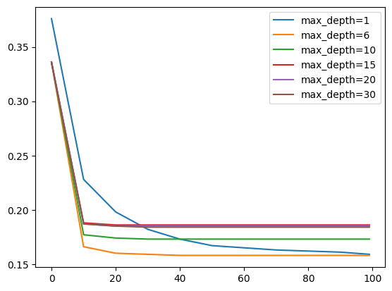
    - `min_child_weight`: how big is the tree? `min_child_weight=10` is the best.....
    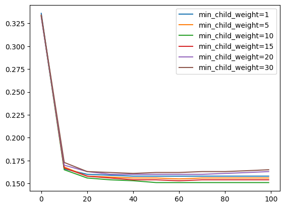

## Choose the final model
- use the above 3 pre-train model to test the rmse
- **xgboost** is the winner 💥

## Use the full train dataset to train the model again and Test
- repeat the previous steps to clean the data, get feature matirx, train the model and test with test dataset
- check whether you are happy with the result

## Save the model
- `pickle` to save the model

## Transfer the training model to a script
- `train.py`
- the model is saved in `model.bin`

## Load the model start a webservice with flask
- `predict.py`
- In the termianl, run `python3 predict.py` to start your server. You might just need `python yourfilename.py`
- open another terminal to run your `test.py` with `python3 test.py`. Or you might just need `python test.py`. If it shows `{'price': xxxx}`, the model and server are working. a sample house information is in the test file.
- `Ctrl + c` to end the server

## Use the service to generate Kaggle competition results
- `test.ipynb` show how to generate the final results in csv format
- method: read data to dataframe, the cleaning process
- get ids, saleprice array
- write the final results to csv
- upload your csv and check your score and ranking 😊
my first 2 tries are the same: 0.146; there is no difference if you round the number or not.
- definitely need more tunings, if you want to rank higher
**You should be proud of yourself with this compitition.**

## Virtual Environment
- to build a virtual environment, run `pip install pipenv`
- install packages `pipenv install numpy sklearn==1.3.1 flask gunicorn xgboost requests`
- now we have `Pipfile` and `Pipfile.lock`
- next time, when we run in a different machine, run `pipenv install` to install all required packages
- run `pipenv shell` into virtual environment

## Docker
- isoloate the environment from the host machine
- You can find docker image here https://hub.docker.com/_/python
- I have chosen `python:3.10` to match my python version; choose as your choice
- `docker run -it --rm --entrypoint=bash python:3.10` to download the docker image. `it`: access to terminal; `--rm`: remove the image after installation; `-entrypoint=bash`: communicate with the terminal using `bash` in the image
- create a file `Dockerfile`
``````python
# install python
FROM python:3.10

# install pipenv
RUN pip install pipenv

# create and go to the directory
WORKDIR /app

# copy file to current directory
COPY ["Pipfile", "Pipfile.lock", "./"]

# install packages and deploy them
RUN pipenv install --system --deploy

# copy file and mode to current directory
COPY ["predict.py", "model.bin", "./"]

# open port
EXPOSE 9696

# execute the service, bind the port host to 9696
ENTRYPOINT [ "gunicorn", "--bind=0.0.0.0:9696",  "predict:app" ]
``````

## Deploy to AWS Elastic Beanstalk
- create an aws account
- install eb cli as dev dependency `pipenv install awsebcli --dev`
- go to virtual environment `pipenv shell`
- initial the eb `eb init -p "Docker running on 64bit Amazon Linux 2" predict-house-price`
- `ls -a` to check whether there is `.elasticbeanstalk` folder
- `ls .elasticbeanstalk/` to check the doc inside the folder `config.yml`
- run locally to test `eb local run --port 9696`
- in another terminal run `python3 test.py` or `python yourfile.py` to test
- implement in the cloud: create a cloud environment -> `eb create predict-house-price-env`
- copy the service link to `test.py`, update our url
- run `python3 test.py` or `python yourfile.py` to test

**I have terminated this service to avoid gnerating extra fee.**

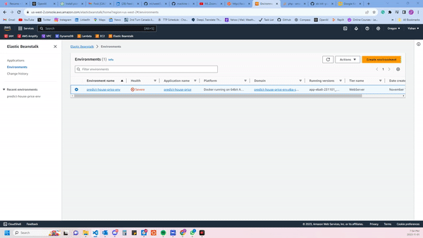